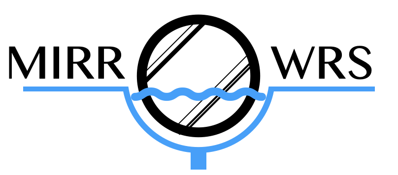

<div align="center">


<h4> Mapper to InfeR River Observations of Widths from Remote Sensing: compute river surface width from a watermask image </h4> 

[](https://www.python.org/downloads/release/python-390/)
[](CONTRIBUTING.md)
[](https://opensource.org/licenses/Apache-2.0/)


<p>
  <a href="#overview">Overview</a> •
  <a href="#install">Download and install</a> •
  <a href="#install">Features</a> •
  <a href="#quick-start">Quick Start</a> •
  <a href="#contribution">Contribution</a> •
</p>
</div>

## Overview

Pronounce it "mirrors" !

MIRROWRS is a simple Python-based toolbox designed to compute river widths from a space-borne watermask given a set of section (line geometries) along the river.


## Download and install

Main version available on github : https://github.com/csgroup-oss/MIRROWRS

### General

Using a virtual environment is strongly recommended.

```bash
python3 -m venv venv_mirrowrs
source venv_mirrowrs/bin/activate
pip install -e .
```

### Special case with python 3.12

If you have python-3.12 and `sw1Dto2D` is already installed, then running this command will install MIRROWRS requirements

```bash
# if gdal is not yet installed 
pip install GDAL==`gdal-config --version`

pip install -e .

```

## Features

Using the MIRROWRS toolbox, you can perform two tasks :

- Given a watermask (as a GeoTiff file), a set on centerline reaches (as a shapefile of LineString) and a set of sections (as a shapefile of LineString),
derive the river widths along the sections
- If the sections lines are not available, using the centerline reaches (as a shapefile of LineString) and a set of segmentation points (as a shapefile of Point),
you can draw the sections yourself


## Quick start

### Functionnality tests

To run functionnality tests, use the entrypoint

```bash
run_functionnality_tests
```

### Example

To use MIRROWRS on Surfwater watermasks, here is the general command

```bash
run_example -w /path/to/water_mask.tif -dt YYYYmmddThhmmss -r /path/to/eu_sword_reaches_hb23_v16.shp -n /path/to/eu_sword_nodes_hb23_v16.shp -o /path/to/output/directory
```

This will only save a csv file with widths data. You can had `--more_outputs` to also save the cleaned watermask and the shapefile.  

## Contribution

To do a bug report or a contribution, see the [**Contribution Guide**]().
For project evolution, see [**Changelog**]().

## Credits

See [Authors file]()

## License

MIRROWRS is licensed by [CS GROUP](https://www.c-s.fr/) under
the [Apache License, version 2.0](http://www.apache.org/licenses/LICENSE-2.0.html).
A copy of this license is provided in the [LICENSE](LICENSE) file.